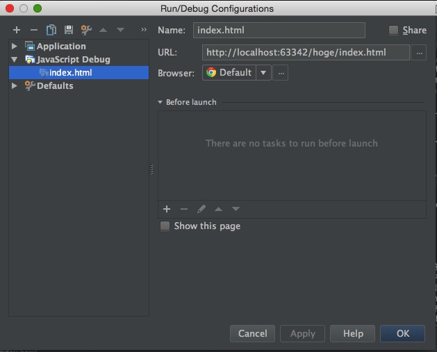
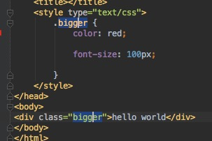

#HTMLファイルの編集
1. プロジェクトペインでCtrl+N->HTMとタイプし"HTML File"ダイアログを表示。indexと入力してindex.htmlを作成

2. bodyタグ内でdiv.myclass{Hello World}を記入、tab(Emmet/Live Template)
[Emmetについて詳しくはこちら](http://docs.emmet.io)
3. Shift+Ctrl+F9でChromeでデバッグ(Chrome以外のブラウザが立ち上がる場合はindex.htmlのEdit Configurations->BrowserよりChromeを選択)

4. ブラウザとIntelliJ IDEAを横に並べる形にウインドウを整理。エディタペインが小さくなってしまうのでShift+Cmd+F12でエディタペインを最大化(もう一度Shift+Cmd+F12で戻ります)
5. myclassにカーソルを当て、Alt+Enter、Create Selectorを選択し、Current fileを選択。スタイルシートのmyclassを生成
6. myclass内で"color: r"と入力。redが候補として挙がるのでShift+Cmd+Enter(complete current statement)で選択とセミコロン入力まで行ってもらう。
7. "font-s"と入力。font-sizeが候補として挙がるので選択。100pxと入力
8. リアルタイムに編集結果が反映されているのを確認。LiveEditプラグイン(IDEA側)、JetBrainsプラグイン(Chrome側)がうまく働いている必要があります。LiveEditがうまく働かない場合(特にJetBrains IDEを複数開いている場合に発生する)はIDEAとChrome両方を再起動すると直ります
9. myclassにカーソルを当て、Shift+F6(Rename..)を押してリネームダイアログを出し、biggerという名前にする。スタイルシート側も、div側も同時に名前が変更されているのを確認
10. Cmd+Wを押し(Extend SelectionまたはStructural Selection)、biggerを選択、Ctrl+G(Add Selection for next occurrence)。biggerのスタイル定義箇所と、利用箇所両方にカーソルを当てる(マルチカーソル)

11. クラス名を任意の名前に編集

#プロジェクト内のナビゲート
1. Twitter4Jのプロジェクトウインドウを開く
2. Shift二回でsearch everywhereポップアップを表示、twitterとタイプしてenter、Twitterクラスにジャンプ
3. interface Twitterの"Twitter"部にカーソルを当て、Alt+Cmd+B(Implementations、実装クラス一覧)を押し、TwitterImplを選択してジャンプ
4. Cmd+F12(File Structure)を押してファイル構造のポップアップを表示"ght"とタイプし、getHomeTimeLineメソッドを絞り込み、実装部にジャンプ
5. alt+F7(Find Usages)を押し、警告が出るのでYesを選択(実装クラスなのでインターフェース定義の使用箇所を検索するかどうかの確認)
6. 画面下部にFindタブが現れるのでfrtとタイプ、FindResourcesTestを展開、ghtとタイプ、testFavoriteMethodsを絞り出しジャンプ
7. testFavoiteMethods内でShift+Ctrl+F9を押しデバッグ(テストに必要なファイルがないのでテストは失敗します)
8. Shift二回でsearch everywhereポップアップを表示、cbと入力してConfigurationBuilderを選択、ジャンプ