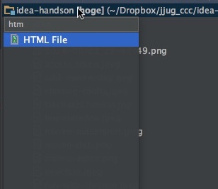
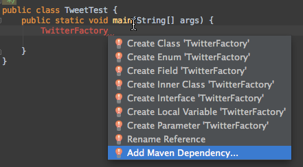

IntelliJ IDEAハンズオン
=========

# 参加に必要なもの

### ソフトウェア: IntelliJ IDEA 14 Ultimate Edition
[ダウンロードはこちら](http://www.jetbrains.com/idea/download/)

オープンソース、無償版のCommunity EditionではなくUltimate Editionを使います(30日の無償試用あり、試用版でもハンズオンにご参加いただけます)

### ソースコード: Twitter4J
[ダウンロードはこちら](http://twitter4j.org/archive/twitter4j-4.0.2.zip)

コードブラウズの演習に使います
### ハードウェア: 十分に充電されたラップトップPC

# あると良い物
### ソフトウェア: Live Editプラグイン、Chrononプラグイン
Preferences -> Plugins -> Install JetBrains plugin.. よりLiveEdit、Chrononプラグインをインストールしておいてください。
どちらも無償でご利用いただける純正プラグインです。

### ソフトウェア: Google Chrome/JetBrains Pulgin
LiveEdit機能によりHTML/JavaScriptのリアルタイム編集を行うのに必要です。
Chromeを開いて[chrome web store](https://chrome.google.com/webstore/category/apps)より"JetBrains"を検索してインストールしてください。無償でご利用いただけるChromeエクステンションです。

### ハードウェア: WiFiルータまたはテザリングできる携帯電話
時間が限られる中、多数の参加希望者を可能な限りサポートさせて頂くため当日はチャットルームを用意する予定です。
チューターだけでなく参加者同士でも助け合いながらハンズオンを進めて頂ければ幸いです。全員がテザリングを行うとネットワークが輻輳してしまう場合がございます。極力近くにお座りの方とネットワークをシェアしていただきますようお願い致します。
(会場でのネットワークの提供はございません)

#プロジェクト内のナビゲート、の準備
1. Twitter4Jのプロジェクトを開く
[こちらからダウンロード](http://twitter4j.org/archive/twitter4j-4.0.2.zip)、または[こちらからclone](https://github.com/yusuke/twitter4j)したTwitter4JのプロジェクトをIDEAで開く

2. インデックスが完了するまでHelloWorldやFizzBuzzを書く

#プロジェクトの作成
1. File->New Project...->Maven->(Create from archetypeは未チェックのまま)Next
2. GroupId: 任意、ArtifactId: 任意、Version:任意(1.0-SNAPSTOTのままでOK)→Next
3. Project Name: 任意、Project Location:任意→Next
4. プロジェクト作成ができたら"Maven projects need to be imported"と出るので"Enable Auto-Import"をクリック 

クリックしそこねたら後からPreferences...->Maven->Importing->Import Maven projects automaticallyにチェックを入れる

#Hello Worldアプリの作成
1. Cmd + 1(プロジェクトペインへフォーカス移動)→[プロジェクト名]→src→main→javaへ移動
2. Ctrl+N(またはFile>New...)->Java Class
3. Name: Hello、Kind: Class  

4. Helloクラスを作成できたらブレース内にカーソルを移動
5. "psvm"とタイプし、tab(LiveTemplate機能によりpublic static void mainに展開される)
6. "sout"とタイプし、tab
7. "Hello World"をタイプ
8. Shift + Ctrl + F10(またはRun>Run...)より実行  
Shift + Ctrl + F10では今カーソルがあるクラスのmainメソッド、またはカーソルがある位置のテストメソッド、テストケースだけれどもテストメソッド内にカーソルがない場合はそのテストクラスのテスト全てを実行する設定を仮に作って実行してくれます。実行時のパラメータなどを指定したい場合は右上のプルダウンメニューよりEdit Configruations...を、実行設定を保存したい場合はSave *** Configurationを選びます。  

#Fizz Buzz
Fizz Buzzは数値を3で割り切れるときは"fizz"、5で割り切れるときは"buzz"、両方で割り切れるときは"fizzbuzz"、それ以外の場合は数値そのものをプリントするプログラムです。

1. FizzBuzzクラスを作成し、mainメソッドを作成
2. foriとタイプしてtab(LiveTemplate)、インデックスを0から99までループするコードを作成
3. i%3==0ifとタイプしてtab(postfix completion)、"fizz".soutとタイプしてtab(postfix completion)
4. 同様に5で割り切れる場合は"buzz"とプリントさせる
5. 次にif(i%3!=0&&i%5!=0とタイプしてShift+Cmd+Enter(complete current statement)、3でも5でも割り切れない場合の条件部を完結させる
6. i.soutとタイプしてtab(postfix completion)
7. Alt + Cmd + L(Reformat code)によりコードをフォーマット
通常fizz buzzでは3でも5でも割り切れる場合、"fizz buzz"のように一行にプリントしますが、演習をシンプルにするためこのコードでは途中で改行されます。

#Chrononを使ったデバッグ
Run>Edit Configurations...>ChrononよりFizzBuzzタイムラインをダンプするをChrononのカバー対象として設定

Run *** with Chronon(実行ボタンの三つ右の黄色いアイコン)より実行

#HTMLファイルの編集
1. プロジェクトペインでCtrl+N->HTMとタイプし"HTML File"ダイアログを表示。indexと入力してindex.htmlを作成

2. bodyタグ内でdiv.myclass{Hello World}を記入、tab(Emmet/Live Template)
3. Shift+Ctrl+F9でChromeでデバッグ(Chrome以外のブラウザが立ち上がる場合はindex.htmlのEdit Configurations->BrowserよりChromeを選択)

4. ブラウザとIntelliJ IDEAを横に並べる形にウインドウを整理。エディタペインが小さくなってしまうのでShift+Cmd+F12でエディタペインを最大化(もう一度Shift+Cmd+F12で戻ります)
5. myclassにカーソルを当て、Alt+Enter、Create Selectorを選択し、Current fileを選択。スタイルシートのmyclassを生成
6. myclass内で"color: r"と入力。redが候補として挙がるのでShift+Cmd+Enter(complete current statement)で選択とセミコロン入力まで行ってもらう。
7. "font-s"と入力。font-sizeが候補として挙がるので選択。100pxと入力
8. リアルタイムに編集結果が反映されているのを確認。LiveEditプラグイン(IDEA側)、JetBrainsプラグイン(Chrome側)がうまく働いている必要があります。LiveEditがうまく働かない場合(特にJetBrains IDEを複数開いている場合に発生する)はIDEAとChrome両方を再起動すると直ります
9. myclassにカーソルを当て、Shift+F6(Rename..)を押してリネームダイアログを出し、biggerという名前にする。スタイルシート側も、div側も同時に名前が変更されているのを確認
10. Cmd+Wを押し(Extend SelectionまたはStructural Selection)、biggerを選択、Ctrl+G(Add Selection for next occurrence)。biggerのスタイル定義箇所と、利用箇所両方にカーソルを当てる(マルチカーソル)

11. クラス名を任意の名前に編集

#プロジェクト内のナビゲート
1. Twitter4Jのプロジェクトウインドウを開く
2. Shift二回でsearch everywhereポップアップを表示、twitterとタイプしてenter、Twitterクラスにジャンプ
3. interface Twitterの"Twitter"部にカーソルを当て、Alt+Cmd+B(Implementations、実装クラス一覧)を押し、TwitterImplを選択してジャンプ
4. Cmd+F12(File Structure)を押してファイル構造のポップアップを表示"ght"とタイプし、getHomeTimeLineメソッドを絞り込み、実装部にジャンプ
5. alt+F7(Find Usages)を押し、警告が出るのでYesを選択(実装クラスなのでインターフェース定義の使用箇所を検索するかどうかの確認)
6. 画面下部にFindタブが現れるのでfrtとタイプ、FindResourcesTestを展開、ghtとタイプ、testFavoriteMethodsを絞り出しジャンプ
7. testFavoiteMethods内でShift+Ctrl+F9を押しデバッグ(テストに必要なファイルがないのでテストは失敗します)
8. Shift二回でsearch everywhereポップアップを表示、cbと入力してConfigurationBuilderを選択、ジャンプ

#時間のある方はTwitter4Jを使った簡単なコードをChrononでデバッグしてみましょう

#dev.twitter.comにおけるアプリケーション登録、アクセストークン作成
1. [dev.twitter.com](https://apps.twitter.com/app/new)にアクセス
2. Twitterアカウントでログイン
3. Name、Description(10文字以上)、Website(とりあえずhttps://twitter.com/自分のアカウント、でもOK)を記入
4. 開発者規約をよく読んで承諾したらYes, I agreeにチェックを入れてアプリ登録
5. Details>Application Settings>Access level>modify app permissionsより"Read and Write"に変更してアプリケーションからのツイートを可能にする
6. API Keysのタブに移動し、Access levelがRead and writeになっているのを確認する(反映までしばらく時間がかかることもあるので、なっていない場合は1、2分待ってリロード
7. API Keys>Create my access tokenを押してアクセストークンを生成。  
しばらく待ってからリロードするとアクセストークンが生成されているのでAPI key、API secret、Access token、Access token secretをsrc/main/resources/twitter4j.propertiesに保存  
  
  
参考:[Twitter4J-設定](http://twitter4j.org/ja/configuration.html)

#ホームタイムラインのダンプ
1. 新しいクラスを作り、mainメソッド内に"TwitterFactory"と記載
2. シンボルを解決出来ず、赤くハイライトされるのでalt+Enter>Add Maven Dependencyよりtwitter4j、バージョン4.xを依存に追加  
  
Twitter4Jが見つからない場合はPreferences>Maven>Repositoriesよりrepo1.maven.org/maven2を選択してUpdate  

3. 依存を追加したら、もう一度alt+Enter>Import Classでtwitter4j.TwitterFactoryをインポート
4. ".ge"と入力し、補完候補(getSingleton)が現れたらTabを押して補完
5. さらに".var"と入力し、変数を導入([postfix completion](http://blog.jetbrains.com/jp/2014/03/19/433))
6. Twitter型の変数より、getHomeTimeline()を呼び出し、さらにその戻り値もpostfix completionで変数に代入
7. TwitterExceptionをキャッチしていないと警告が出るので赤線が出ている箇所でalt+Enter>Add Exeption to Method Signatureで例外宣言を追加
8. homeTimelineとタイプしたら.forとタイプしてtab、拡張for文を作成
9. status.getText()とタイプして.sout、タブ。status.getText()をプリントするコードにする
10. 実行  

#Chrononを使ったデバッグ
Run>Edit Configurations...>Chrononよりタイムラインをダンプするクラスと、twitter4j.*をChrononのカバー対象として設定  
  
Run *** with Chronon(実行ボタンの三つ右の黄色いアイコン)より実行  
  

